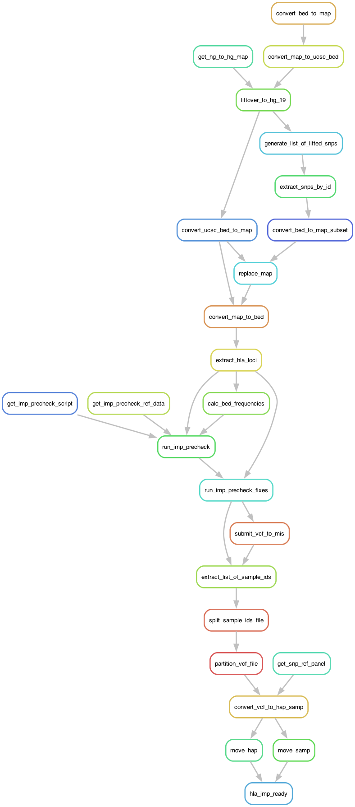

# HLA_IMP_READY
## _A Snakemake Pipeline to Prepare SNP Microarray data for use with [HLA*IMP3](https://imp.science.unimelb.edu.au/hla/)_

## Authors
* Christopher Michael Brooks ([@chrismbrooks](https://github.com/chrismbrooks))

# Workflow Overview



# Table of Contents
1. [Setup](#setup)
2. [Input](#inputs)
3. [Run](#run)
3. [Output](#output)

# Setup
To download and configure the pipeline, run the following command:

```sh
    git clone https://github.com/ChrisMBrooks/HLA_IMP_READY.git
    cd HLA_IMP_READY
```

Next, navigate to the [Michigan Imputation Service](https://imputationserver.sph.umich.edu/index.html#!pages/profile) to obtain your API-KEY (you will need to register and create an account.). Under API access click create and copy the ``API-Token``. Add the ``API-Token`` into the ``example.pipeline.config.json`` file, e.g.:

```json
    "mich_imp_config":{
        "url":"https://imputationserver.sph.umich.edu/api/v2",
        "endpoint_suffix":"jobs/submit/minimac4",
        "auth_token":"!!!!!!!!!!!!!!!-PASTE-THE-API-TOKEN-HERE-!!!!!!!!!!!!!!!",
        "params":{
            "mode": "imputation", 
            "refpanel": "1000g-phase-3-v5",
            "phasing":"eagle",
            "population": "eur",
            "build":"hg19",
            "r2Filter":0   
        }
    }
```

Finally, create a conda environment using the provided ``Envs/snakemake_env.yml`` environment file: 

```sh
conda create -f Envs/snakemake_env.yml
```

# Input
Two main input files must be configured or be made available before the pipeline can be run: 
* ``pipeline.config.json`` configuration files
* ``.bed / .bim / .fam`` SNP geneotype files

## Pipeline Config JSON

The ``pipeline.config.json`` file is a simple high level JSON file containing configuration settings and metadata. The following key-item pairs are required: 

* ``project`` is an input string, and represents the project name to be used by snakemake, e.g. ``HLA_IMP_READY_TEST``. 

* ``bed_bim_fam_filename`` is the filepath location to the ``.bed / .bim / .fam`` files. All files must have the same filename. The text in the JSON attribute should include the directory path and the filename, but not the file extension. 

* ``bed_bim_fam_hg_build`` is the reference genome used when constructing the ``.bed / .bim / .fam`` files. The following builds are supported: hg38, hg16, hg17, hg18 & hg19. HLA*IMP requires hg19 so all files will be lifted over to this reference genome.   

* ``num_data_partitions`` is the number of files to segment the HLA\*IMP input file into. HLA\*IMP Required Oxford HAPS/SAMPLE files of less than 100MB, so it is likely necessary to partition the data into two or more input files. 

* ``phasing_results_loc`` is the filepath location to the ``chr6.dose.vcf.gz`` files to be extracted from the Michigan Imputation Service. This is discussed in detail in the Run Section. The text should include the path, filename and extension, e.g.: ``Input/chr_6/chr6.dose.vcf.gz``.

# Run
The Michigan Imputation Service does not easily support API download, so the snakemake pipeline must be run in two parts:

## Part Ia

Activate the snakemake conda environment, ``snakemake_env`` and then run the following command:  

```sh
snakemake --cores 8 --use-conda --conda-frontend conda --until "submit_vcf_to_mis" --keep-going
```
 > NB - The imputation service can take several hours to complete. You will receive an automated email from the Michigan Imputation Service once your job(s) have completed. 

## Part Ib
Once you have received the automated email, navigate to the [Michigan Imputation Service Job Page](https://imputationserver.sph.umich.edu/index.html#!pages/jobs) and download the result. Use the password provided in the automated email to unlock the results from the downloaded ``.zip`` file. Then revise the ``pipeline.config.json`` to ensure the ``phasing_results_loc`` attribute points to this location. 

```sh
curl -sL https://imputationserver.sph.umich.edu/get/3552641/ea531f1b5bac70b68d21aad4db171d071eb145581cbeacbf067421a49cb4306a | bash
unzip -P INSERT-MIS-PROVIDED-PASSWORD chr_6.zip
```

> NB - From the extracted results, ensure the ``chr6.dose.vcf.gz`` file is palced in the ``Input/chr_6/ directory``, or edit the ``phasing_results_loc`` entry in the ``pipeline.config.json`` file. 

## Part II 

Once the ``chr6.dose.vcf.gz`` is in place, run the remainder of the snakemake pipeline as follows: 

```sh
snakemake --cores 8 --use-conda --conda-frontend conda --keep-going  --rerun-incomplete
```

# Output

The phased Hap/Samp files for each of N partitions are output into the ``Output/Liechti2023/HLA_IMP_READY``, e.g.:

* datafile.chr6.20to40.chr6.20_to_40mb.dose.1.hap.gz 
* datafile.chr6.20to40.chr6.20_to_40mb.dose.1.sample
* datafile.chr6.20to40.chr6.20_to_40mb.dose.2.hap.gz 
* datafile.chr6.20to40.chr6.20_to_40mb.dose.2.sample

# Afterward

To obtain imputation results, individually upload each of the Hap/Sam pairs to the [HLA*IMP3 Jobs Page](https://imp.science.unimelb.edu.au/hla/jobs). You will need to register and create an account. You will need to provide which of the SNP array and manufacturer were used to generate the ``.bed / .bim / .fam`` input files, e.g. HumanOmni5-4 v1.1. Upon completion of the HLA imputation you will receive a confirmation email and ``acces key``. Results can be downloaded from the same Jobs Page. 
